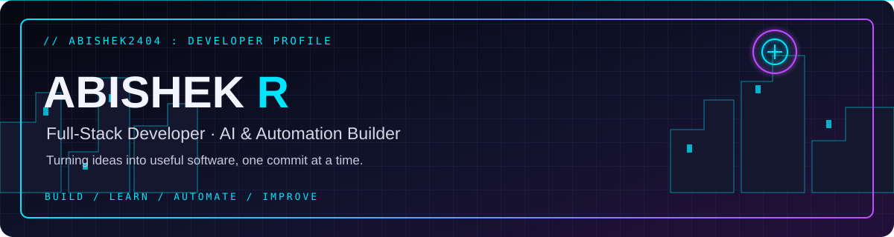
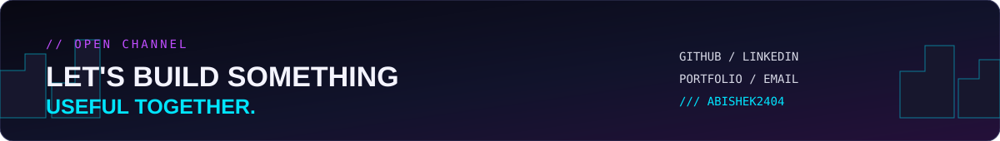

**FULL-STACK DEVELOPER · AI BUILDER · AUTOMATION ENTHUSIAST**

*Turning ideas into useful software, one commit at a time.*

---

## `01 // ABOUT ME`

Hey, I'm **Abishek R**, a Physics graduate and developer focused on building practical web applications, AI-powered tools, and workflow automations.

- 💻 Building full-stack applications with React, Node.js, Express, and databases.
- 🤖 Exploring AI assistants, voice automation, LLM integrations, and adaptive learning.
- 🧰 Interested in APIs, data modelling, testing, deployment, and solving real product problems.
- 🌱 Always learning by building and improving real projects.

## `02 // TECH STACK`

## `03 // FEATURED PROJECTS`

| Project | What it does | Technologies |
|---|---|---|
| 🚨 **SOS Emergency Response** | Emergency trigger workflows, incident tracking, admin dashboard and mobile app | React, TypeScript, React Native, Expo, Node.js, Prisma |
| ☎️ **AI Recruitment Calling Automation** | Candidate calling workflows, call logs, transcripts and follow-ups | Node.js, TypeScript, PostgreSQL, n8n, voice AI APIs |
| 🧠 **NEXUS AI** | Adaptive learning assistant concept with AI and conversation memory | FastAPI, Gemini, Prisma, vector search |
| 📚 **EduFlow LMS** | Learning platform concept for courses, notes, bookmarks and AI study content | React, APIs, Prisma, Supabase |
| 📖 **Personalized Book Recommender** | Book recommendations using content similarity | Python, pandas, cosine similarity, Streamlit |
| 💸 **Money Manager** | Income and expense dashboard across time periods | React, JavaScript, data visualization |

> Project links are intentionally not guessed. Replace the project names with links to the correct public repositories when ready.

## `04 // GITHUB DASHBOARD`

## `05 // CURRENT QUESTS`

- [ ] Ship polished, reliable full-stack projects.
- [ ] Strengthen automated testing, security, and observability.
- [ ] Build useful AI agents and voice workflows.
- [ ] Keep learning through practical projects.

## `06 // CONNECT`

**Open to interesting projects, collaboration, and developer opportunities.**

[GitHub](https://github.com/Abishek2404) · [LinkedIn](https://www.linkedin.com/in/abishek-raja-/) · [Portfolio](https://abishekr-portfolio.netlify.app) · [Email](mailto:abir33856@gmail.com)

BUILD · LEARN · AUTOMATE · IMPROVE

